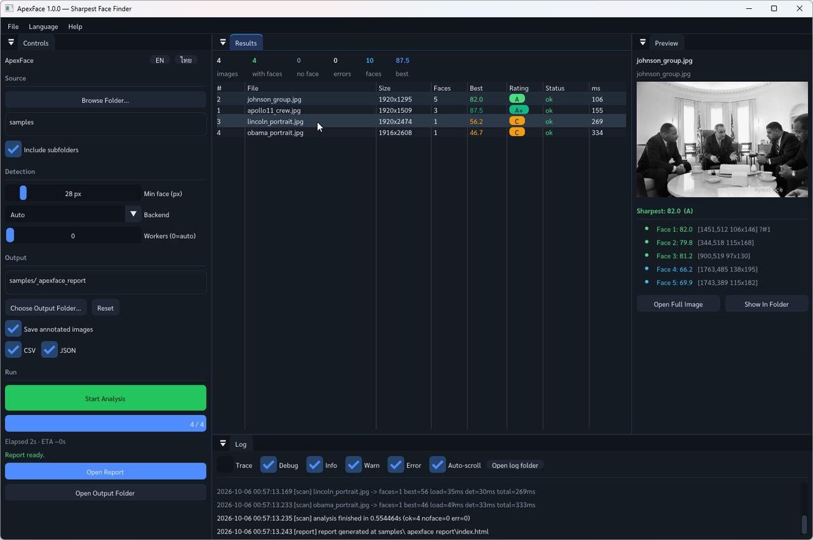
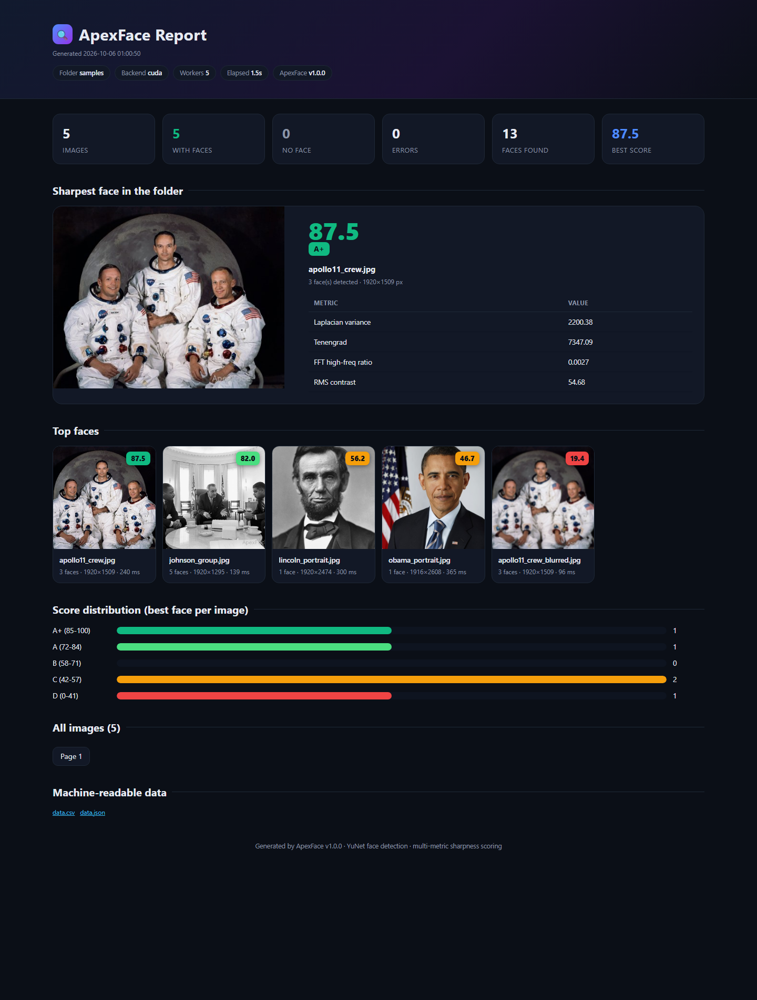
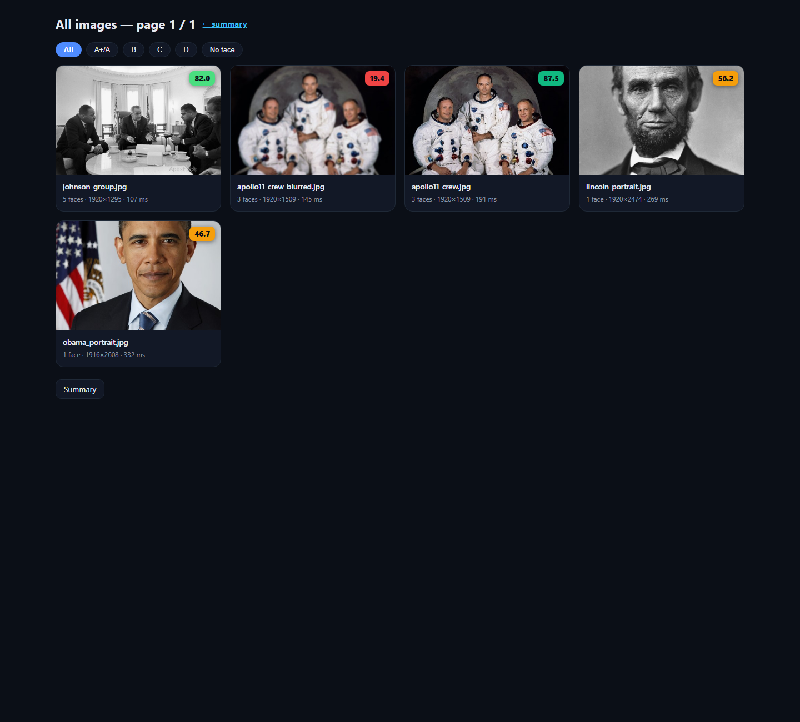
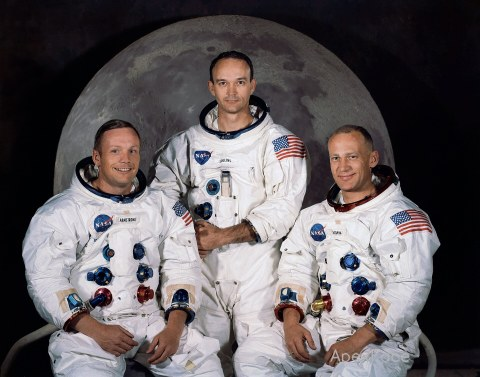

# 🔍 ApexFace — Sharpest Face Finder

**ApexFace** scans a folder of photos, finds **the sharpest face in every image**, scores it
0–100, and generates a beautiful interactive HTML report with annotated images — face boxes,
scores and ratings at a glance. Ships with a modern desktop GUI *and* a CLI, and runs its
detector on **CUDA or CPU** automatically.



*(GUI: dockable panels — controls, live results table, preview with per-face metrics, and a
real-time log panel. UI available in English and Thai.)*

---

## Why ApexFace?

If you shoot events — races, weddings, group sessions — you end up with thousands of near
identical frames where the *only* meaningful difference is whether the subject's face is
critically sharp. ApexFace automates the triage:

- **Pick the keeper automatically** — the best-scoring face per image is highlighted (#1) with
  a colored rating badge.
- **Understand every score** — the report exposes the underlying metrics (Laplacian variance,
  Tenengrad, FFT high-frequency ratio, RMS contrast) per face.
- **Go through thousands of photos fast** — multi-threaded pipeline, ~26 photos/s on a GTX
  1060 for 24 MP files.
- **Get a shareable report** — a dark-themed HTML report with a hero card, top gallery, score
  distribution and filterable card grid, plus `data.csv` / `data.json` for scripting.

## Features

| Area | Details |
|---|---|
| Detection | Google **YuNet** (2023mar, 232 KB ONNX) via `cv::FaceDetectorYN`; auto **CUDA → CPU** fallback; boxes mapped back to full resolution; EXIF orientation handled correctly for portrait/landscape mixes |
| Sharpness score | Weighted multi-metric score (0–100) with small-face attenuation; ratings **A+ / A / B / C / D**; no-face photos are graded D |
| Move rejects | Optionally move grade-D / no-face originals into `_apexface_rejects/` after the run (GUI checkbox or `--move-d`), keeping relative paths — every move is logged and listed in the report |
| GUI | Dear ImGui docking UI: folder picker (native dialog), live progress, results table, preview panel with per-face metrics, log viewer, EN/ไทย toggle |
| CLI | `apexface-cli <folder> [options]` for batch/scripted use, `--dump-metrics` for calibration |
| Report | `index.html` summary + paginated card pages + `data.csv` + `data.json` + annotated full-res copies + thumbnails |
| Logging | Session `.log` (TRACE..ERROR, ms timestamps, categories) **and** structured `.events.jsonl` for machine analysis; log copied into every report |
| Robustness | Unicode-safe file IO with EXIF orientation handling; skips its own output folders; per-file error isolation |

## Report preview



*(Summary page: hero card for the sharpest face in the folder, top gallery with score badges,
score distribution. Each card links to the full annotated image.)*



## Quick start

### GUI

1. Download and unzip the release, run `ApexFace.exe`.
2. **Browse Folder…** → pick your photo folder.
3. **Start Analysis** → wait for *Report ready* → **Open Report**.

### CLI

```bat
apexface-cli.exe D:\photos --recursive --min-face 28 --backend auto --out D:\photos\_apexface_report
```

```
=== ApexFace summary ===
images      : 400
with faces  : 400
no face     : 0
errors      : 0
faces found : 708
best score  : 83.11 (DEC00387.JPG)
backend     : cuda
elapsed     : 15.4 s
```

Options: `--out DIR · --no-recursive · --min-face N · --backend auto|cpu|cuda · --workers N ·
--no-annotated · --no-csv · --no-json · --move-d · --max-images N · --dump-metrics F · --quiet`

`--move-d` relocates grade-D and no-face originals into `<folder>\_apexface_rejects` after the
run (moved, not deleted; every move is logged and listed in the report).

## How the score works

Each face is cropped (50% margin) at full resolution and scored by a weighted blend of
classic focus measures:

| Metric | Weight | What it measures |
|---|---|---|
| Laplacian variance | 55% | Blur sensitivity (second-derivative energy) |
| Tenengrad | 35% | Sobel gradient magnitude energy |
| FFT high-frequency ratio | 10% | Share of spectral energy beyond r > 64 (256×256 crop) |

Faces narrower than 96 px get their score attenuated (down to ×0.55), because a tiny face
carries little detail no matter what. Rating bands: **A+ ≥ 85 · A ≥ 72 · B ≥ 58 · C ≥ 42 ·
D < 42**. The full methodology, calibration data and validation are documented in
[docs/RESEARCH.md](docs/RESEARCH.md).



## Building from source

Requirements: **C++20**, CMake ≥ 3.20, OpenCV 4.x (built with `objdetect` + `dnn`), MSVC 2022
(on this machine OpenCV 4.14 + CUDA is preinstalled at `C:\_OpenCV\install` and registered with
CMake).

```bat
git clone https://github.com/<owner>/ApexFace.git
cd ApexFace
build.bat          :: configure + build (MSVC x64, Release)
scripts\run_gui.bat
```

Third-party libraries (Dear ImGui docking, GLFW 3.4, nativefiledialog-extended) are vendored
in `third_party/` — no network access needed at build time. On other machines pass
`-DOpenCV_DIR="C:/path/to/opencv/install"`.

## Project layout

```
ApexFace/
├── ApexFace.bat        double-click launcher (picks CUDA/CPU/release build)
├── run-cli.bat         drag & drop a photo folder to analyze it from the CLI
├── build-and-run.bat   build + launch, for development
├── src/core/        detection, scoring, scanning, report, logging, settings
├── src/gui/         ImGui app + theme/fonts
├── src/app/         main_gui.cpp / main_cli.cpp
├── models/          face_detection_yunet_2023mar.onnx
├── fonts/           Sarabun (Thai-capable UI font, OFL)
├── samples/         public-domain demo photos (incl. one synthetic blur)
├── third_party/     imgui (docking) · glfw 3.4 · nativefiledialog-extended
├── docs/            README / RESEARCH / CHANGELOG (.md + .html) + img
└── assets/img/      screenshots & diagrams
```

## เอกสารภาษาไทย (สรุป)

**ApexFace** คือโปรแกรมบนเดสก์ท็อป (C++/OpenCV) สำหรับ "หยิบโฟลเดอร์รูปมา แล้วหาว่ารูปไหน
ใบหน้าคมชัดที่สุด" — เหมาะกับช่างภาพงานอีเวนต์ที่ต้องคัดรูปนับพันใบ

1. เปิด `ApexFace.exe` → กด **เลือกโฟลเดอร์...** → กด **เริ่มวิเคราะห์**
2. โปรแกรมตรวจจับใบหน้าด้วยโมเดล YuNet (ใช้ GPU ถ้ามี, ไม่มีก็สลับเป็น CPU อัตโนมัติ)
   แล้วให้คะแนนความคมชัด 0–100 ต่อ "ใบหน้า" (ไม่ใช่ต่อรูป) โดยวัดจาก Laplacian variance,
   Tenengrad และพลังงานความถี่สูงแบบ FFT
3. ได้**รายงาน HTML** สวยงาม: รูปพร้อมกรอบหน้า + ตัวเลขคะแนน + เกรด A+ ถึง D,
   คัดกรองตามเกรดได้ พร้อมไฟล์ `data.csv`/`data.json` สำหรับต่อยอด
4. ตัวเลือกในหน้าจอ: รวมโฟลเดอร์ย่อย, ขนาดใบหน้าต่ำสุด, จำนวนเธรด, บันทึกรูปพร้อมกรอบ,
   ภาษาไทย/อังกฤษ (สลับได้ในโปรแกรม)
5. ทุกการรันมี**ไฟล์ log ละเอียด** (`.log` + `.events.jsonl`) เก็บในโฟลเดอร์ output
   และแนบไปกับรายงาน เพื่อการวิเคราะห์/ดีบักย้อนหลัง

รายละเอียดวิธีคิดคะแนนอยู่ใน [docs/RESEARCH.md](docs/RESEARCH.md) · ประวัติการพัฒนาใน
[docs/CHANGELOG.md](docs/CHANGELOG.md)

## Credits & licenses

- [OpenCV](https://opencv.org/) (Apache-2.0) — detection via `cv::FaceDetectorYN`
- [YuNet face detection](https://github.com/opencv/opencv_zoo) model (Apache-2.0, OpenCV Zoo)
- [Dear ImGui](https://github.com/ocornut/imgui) (MIT), [GLFW](https://www.glfw.org/)
  (Zlib), [nativefiledialog-extended](https://github.com/btzy/nativefiledialog-extended) (Zlib)
- [Sarabun font](https://fonts.google.com/specimen/Sarabun) (SIL OFL 1.1)
- Sample photos in `samples/` are public domain (official White House portrait of Barack
  Obama — Pete Souza; Apollo 11 crew portrait — NASA; LBJ meeting with civil rights leaders —
  NASA/LBJ Library; Abraham Lincoln O-77 — Library of Congress). `apollo11_crew_blurred.jpg`
  is a synthetic Gaussian-blurred derivative created for demo purposes.

## License

MIT — see [LICENSE](LICENSE).
