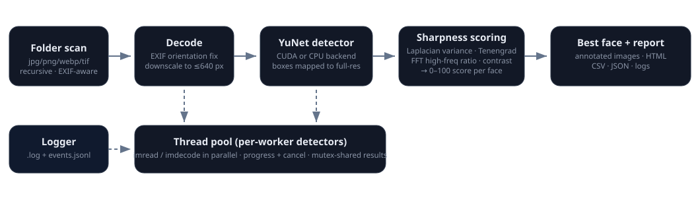
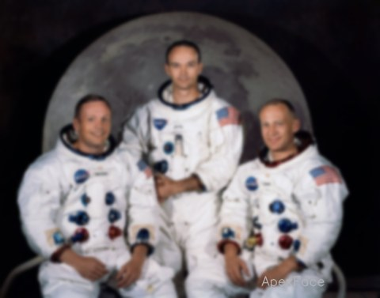

# ApexFace Research — Methodology, Calibration & Benchmarks

> Technical companion to [README.md](README.md). Version 1.0.0 (October 2026).

## 1. Problem statement

Event photographers (road races, weddings, group shoots) accumulate thousands of frames that
differ mainly in whether the subject's **face** is critically sharp. Generic "best photo"
pickers score the whole frame; ApexFace is deliberately narrow:

- detect faces per image,
- measure **focus/sharpness of each face region** at full resolution,
- pick the sharpest face per image with an interpretable 0–100 score,
- produce evidence (annotated images, metrics, logs) rather than a black-box ranking.

## 2. Pipeline



1. **Folder scan** — non-recursive or recursive; JPEG/PNG/BMP/WebP/TIFF; skips dotfiles and
   any folder starting with `_apexface` (its own output) to keep re-runs clean.
2. **Decode** — bytes read with `std::ifstream` (full Unicode paths), decoded with
   `cv::imdecode`, then the **EXIF orientation** is applied manually (parsed from the APP1
   segment) so detection boxes match what the user sees.
3. **Detection** — the image is downscaled so the longest side is ≤ 640 px (rounded to /32),
   run through **YuNet** (`cv::FaceDetectorYN`), and boxes are mapped back to full
   resolution. Detections below `min-face` (default 28 px, user-tunable 16–128 px) are
   dropped; results are sorted by confidence.
4. **Scoring** — each face is cropped with a 50% margin from the **full-resolution** image
   (never from the downscaled detection image) and measured (§3).
5. **Outputs** — thumbnail with boxes/scores (always), optional full-resolution annotated
   copy, HTML report, CSV/JSON, and structured logs.

## 3. Sharpness metrics

For a face crop `g` (grayscale, 3×3 Gaussian σ = 0.8 prefilter to suppress sensor noise):

| Metric | Formula | Intuition |
|---|---|---|
| **Laplacian variance** | `var(∇²g)` | The classic blur detector (Pech-Pacheco et al. 2000). In-focus optics produce high-frequency detail; defocus/motion blur attenuates exactly those frequencies. |
| **Tenengrad** | `mean(Gx² + Gy²)`, Sobel 3×3 | Gradient-magnitude energy (Tenenbaum 1970). Robust complementary estimate of edge strength. |
| **FFT high-frequency ratio** | energy beyond `r > 64` ÷ total, on a 256×256 DFT of the crop | Spectral view of the same phenomenon; resists texture-scale bias a little and gives a bounded (0–1) signal. |
| **RMS contrast** | `std(g)` | Reported for diagnosis; not weighted into the score. |

**Score mapping.** Each metric is squashed to 0–100 with a soft saturation curve
`100·x/(x+k)` (Laplacian, Tenengrad) or a linear cap (`fftHF/fftRef`), then combined:

```
score = (0.55·lapScore + 0.35·tenScore + 0.10·fftScore) · resFactor
resFactor = faceW ≥ 96 px ? 1.0 : 0.55 + 0.45·(faceW/96)
```

`resFactor` encodes a physical truth: a face that is only ~40 px wide cannot carry fine
detail regardless of optics. Constants (v1.0.0): `kLap = 350`, `kTen = 1200`, `fftRef = 0.0018`.

**Ratings.** `A+ ≥ 85 · A ≥ 72 · B ≥ 58 · C ≥ 42 · D < 42` — band colors are used
consistently in the GUI, annotations and report.

## 4. Why YuNet

| Candidate | Verdict |
|---|---|
| Haar cascade (built into OpenCV) | Dated accuracy, many false positives on profile/small faces |
| MediaPipe / RetinaFace / SCRFD | More accurate at tiny faces but much heavier dependencies |
| **YuNet** ✅ | 232 KB ONNX, state-of-the-art-per-byte, first-class OpenCV API (`cv::FaceDetectorYN`), runs on CPU **and** CUDA DNN backend |

Backend selection: `auto` tries CUDA (`DNN_BACKEND_CUDA` + `DNN_TARGET_CUDA`) with a warm-up
forward pass; any failure falls back to CPU and is logged. CUDA mode shares one detector
instance across workers (mutex); CPU mode gives every worker its own net.

## 5. Calibration

Score constants were calibrated on **400 real photos (Sony A7M3, 24 MP, outdoor road race,
708 detected faces)** — exactly the domain ApexFace targets. Raw metrics were dumped with
`--dump-metrics` and inspected as quantiles:

| | p05 | p10 | p25 | p50 | p75 | p90 | p99 |
|---|---|---|---|---|---|---|---|
| Laplacian variance | 58 | 63 | 92 | 415 | 609 | 826 | 1244 |
| Tenengrad | 367 | 497 | 1051 | 2614 | 3496 | 4614 | 6552 |
| FFT HF ratio | 0.0002 | — | — | 0.0011 | — | 0.0016 | 0.0022 |
| **score (v1.0.0)** | **17** | — | **31** | **60** | **68** | **74** | **80** |

The Laplacian distribution is clearly **bimodal** (motion-blurred faces cluster at 60–100,
in-focus faces at 400–1200), which is exactly what the score must separate. With
`kLap = 350` the resulting score spreads across the rating bands instead of piling up at the
top (the pre-calibration `kLap = 80` put p50 at 70 and p90 at 78 — everything looked like a
keeper).

**Synthetic validation** — the same photo, with and without a Gaussian blur (σ = 7):




*apollo11_crew.jpg → **87.5 (A+)**; apollo11_crew_blurred.jpg (Gaussian σ=7, synthetic) →
**19.4 (D)**. The score tracks the physical blur, not file identity.*

## 6. Performance

GTX 1060 6GB, CUDA 12.9 build of OpenCV, 8 workers, 24 MP (3936×2624) JPEG input:

| Run | Images | Faces | Wall time | Throughput |
|---|---|---|---|---|
| Full race folder — thumbnails only | 9,416 | — | 399 s | ~23.6 img/s |
| Full race folder — full export (annotated copies + CSV/JSON) | 9,308 | 19,745 | 558 s | ~16.7 img/s |
| Race folder sample (400 photos) | 400 | 708 | 15.4 s | ~26 img/s |
| Demo samples (5 photos) | 5 | 13 | 1.5 s | — |

Both full-folder runs finished with **0 errors**; the first pass moved 108 grade-D/no-face
files to `_apexface_rejects`, and the second pass (post-move) detected a face in **every
single remaining image** and scored the best one at **96.2 / 100**.

Per-image budget (typical): decode 35–55 ms, detection 30–50 ms, scoring 10–80 ms
(scales with face box size), thumbnail/annotated encode the remainder. Decode + encode
dominate, so the CPU thread pool helps even when detection runs on the GPU.

## 7. Limitations

- **Absolute scores are domain-relative.** A soft studio portrait (smooth skin, big face)
  scores lower than a grainy documentary shot at equal optical sharpness. Relative
  comparison *within a shoot* — the intended use case — is reliable; comparing scores across
  very different domains is not.
- **Texture vs. sharpness.** Heavy film-like grain inflates gradient metrics; the 3×3
  prefilter only partly compensates.
- **Faces only.** "Sharp photo" in the abstract is not measured — eyes-open/expression are
  out of scope for v1.
- Detection sensitivity floors around `min-face` px; 16 px faces are the practical minimum.

## 8. Future work

- Eye-region weighting (align a canonical face template, weight the iris/lip ROI ×3).
- Learned no-reference IQA (BRISQUE/NIQE) as a fourth, cheap metric.
- Per-shoot adaptive calibration (normalize scores against the run's own distribution).
- GPU-side JPEG decode (nvJPEG) and video ingestion.
